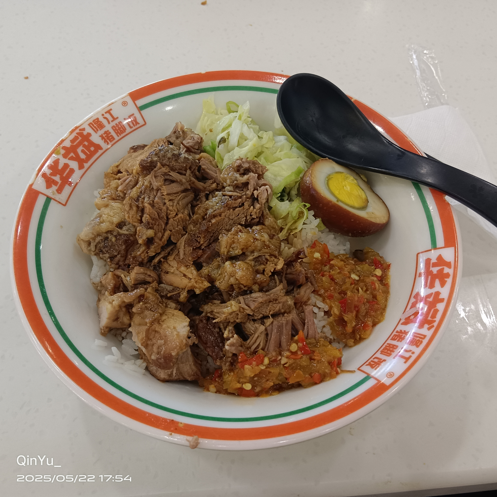
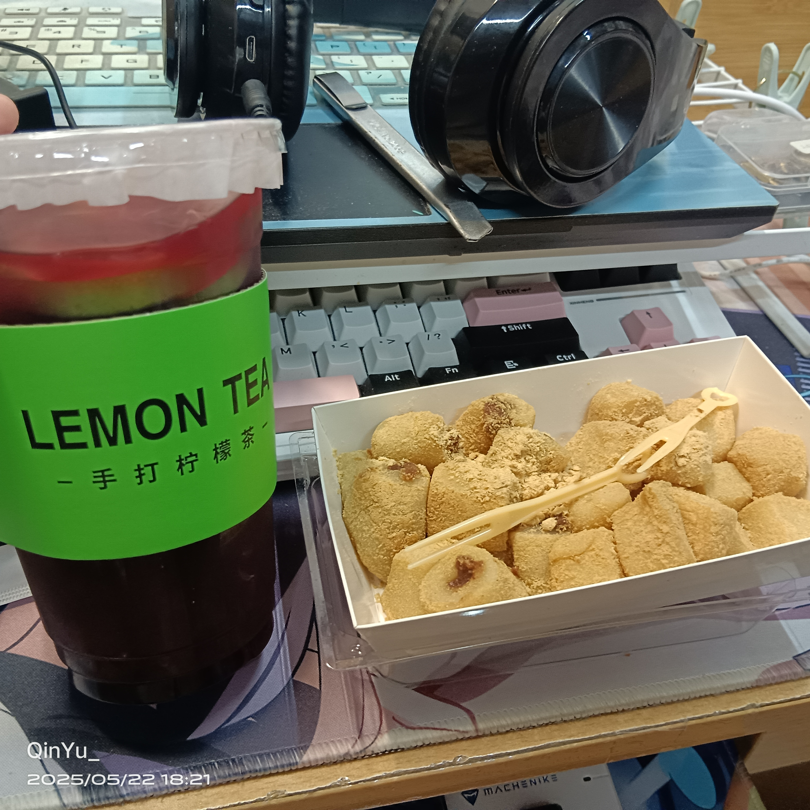
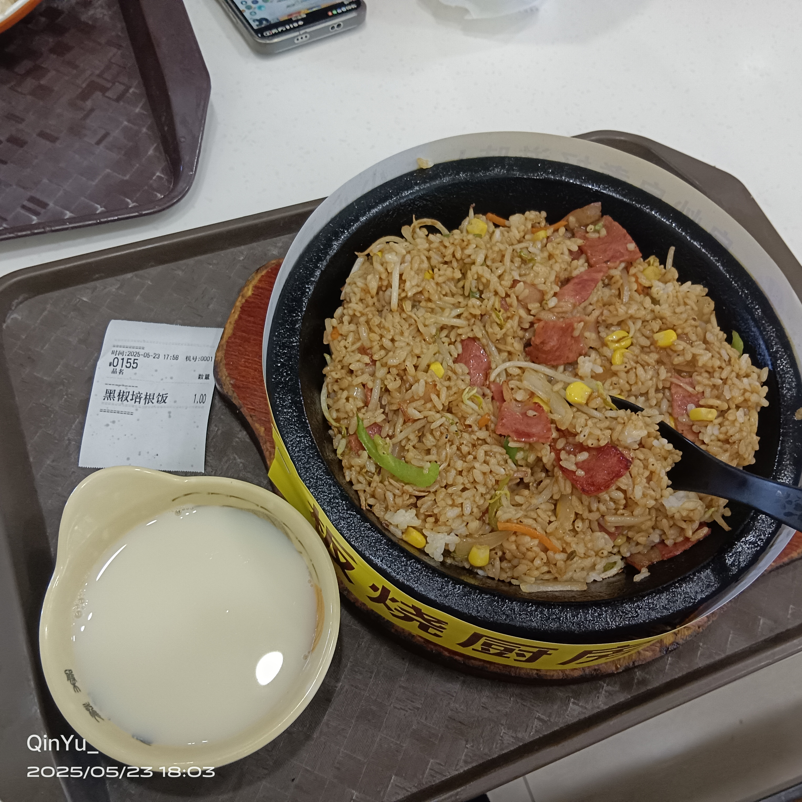
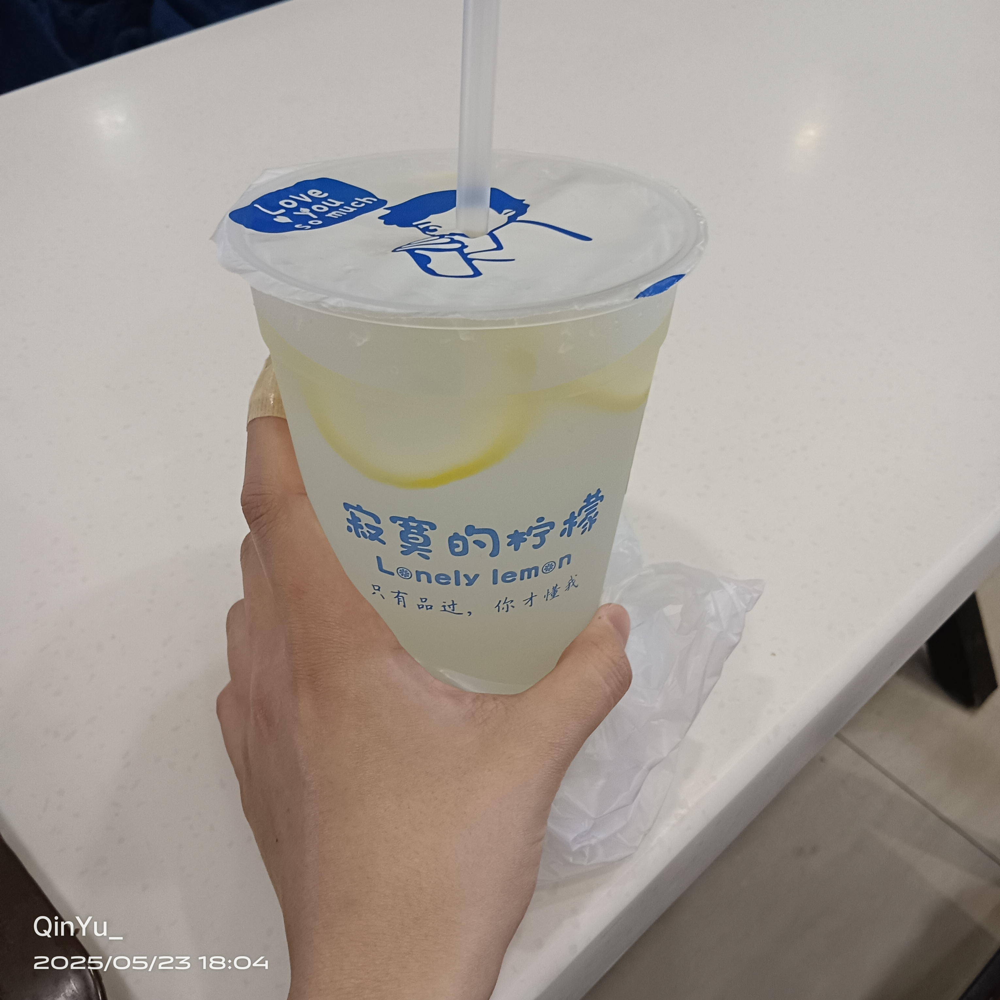
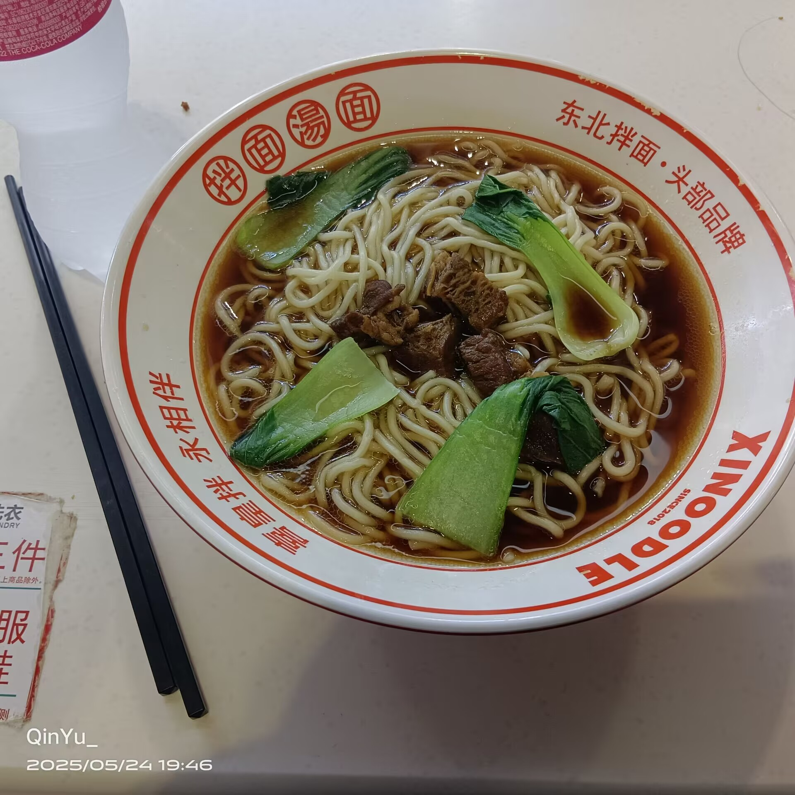
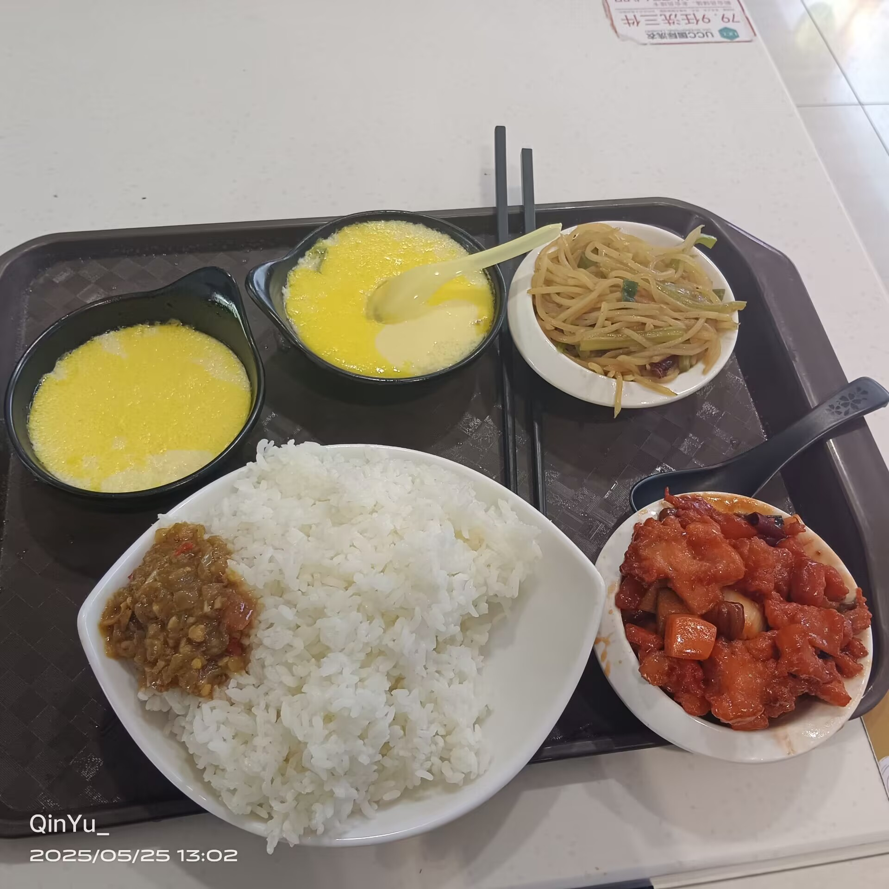
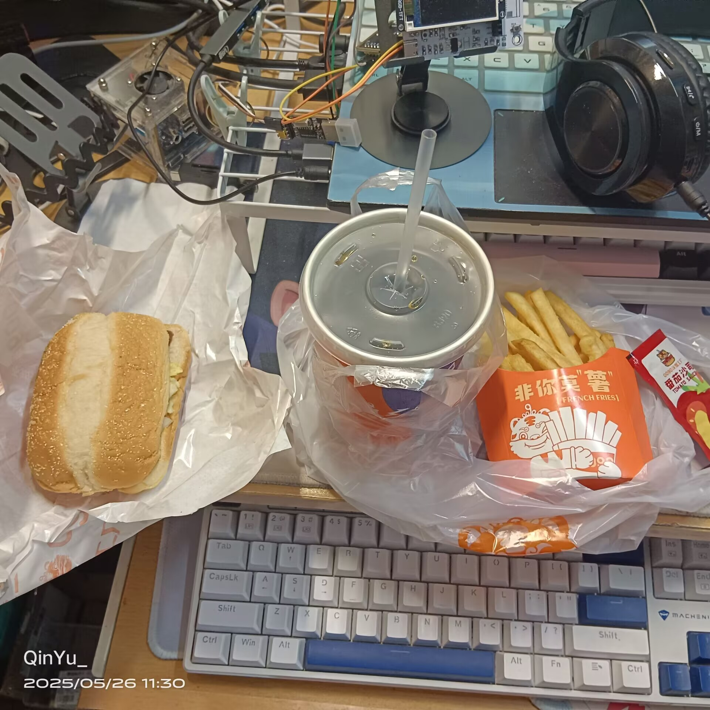
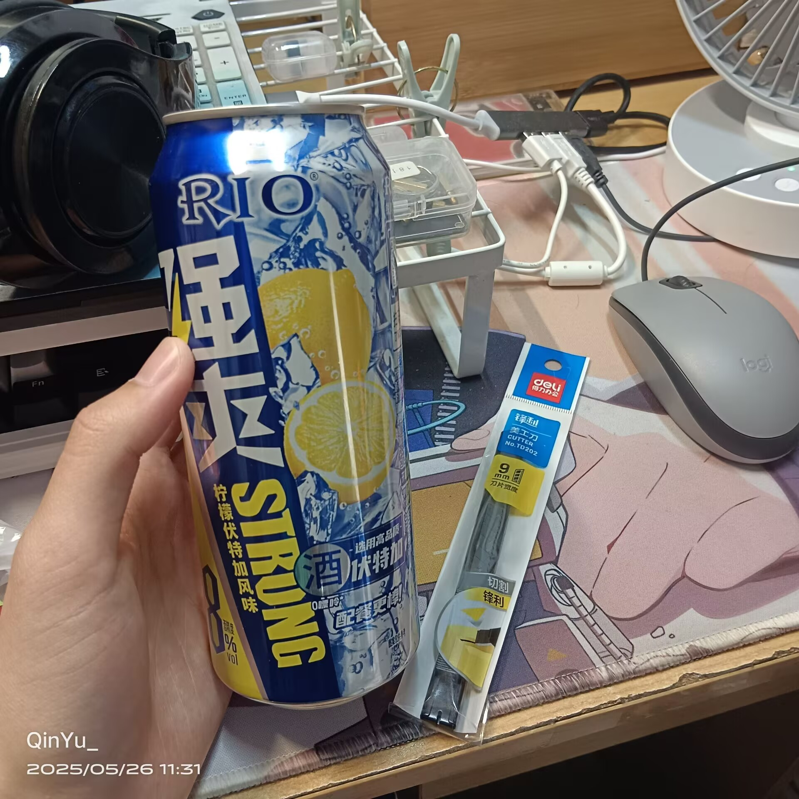

## *隆江猪脚饭*      
* *注 : 有别于鸿鹄猪脚饭... 这里是日新楼*    
---       

    

**中份猪脚饭￥15**    

~~平常都是打包走的，这次直接在餐厅吃~~     
**出餐很快** 就算是饭点也几乎没有等就上餐了    
肉质很嫩 量很多 感觉很对得起价格   
饭中也渗入了酱汁 不会感觉到生或者噎    
***辣椒酱***很好吃 没有很辣但是很香很下饭    
* *⭐⭐⭐很满意，但经常吃可能会腻，不吃又会很想...*    
* 25/5/22-17:54     

     

### 附-日新楼一楼的手打柠檬茶和打糕    

**葡萄桑葚手打柠檬茶[少冰,五分糖]￥8.91**    
**很喜欢**酸甜口味的饮品，     
***桑葚***味道很重，葡萄却没品出来...    
~~这家￥3.9的柠檬水价格约等于蜜雪但量超级大，~~    
~~咱可以喝一下午的量，推荐尝试~~    
* *⭐⭐小贵但好喝的，不过饮料大概都是这个价格，只是咱太穷了些...*    

**打糕￥6**&nbsp;&nbsp;&nbsp;&nbsp;~~打折，平时￥9~~    
就在手打柠檬茶对面，一盒好多有点吃不完    
有点干，但大概黏一点的糕类都是这样的...(?    
* *⭐吃不懂，可能咱对这种饼或糕点类吃不明白...*

   

## *板烧厨房*     
* *注 : 商家出餐带有盘子，不用自己去拿*    
---    

**黑椒培根饭￥14**     

~~店员会在前台把饭拌开，幸苦了~~  
用的盘子大概是保温很热的 有高温防烫的标签    
从头吃到尾 整顿饭都是有温度，    
**温热**略烫但能吃下去的 好开心     
***黑胡椒酱*** 味道很突出很下饭       
店员拌的很开 整盘味道很均匀       
***豆浆*** 很甜很好喝 小小一碗也很满足解渴了w
* *⭐⭐⭐好吃！~~要是**他**也能一直对咱保持**热情**就好了(落泪)~~*    
* 25/5/23-20:08   

     

### 附-日新楼一楼的手打柠檬茶的柠檬水    

**超大杯柠檬水[少冰,五分糖]￥3.9**    
所以今天就买了这家的柠檬水来喝    
可能需要多加***冰***和糖，     
少冰半糖味道咱还可以接受
* *⭐⭐⭐量大，非常多，吃饭时才喝了一半，带回宿舍又喝到刚刚才喝完*    

        

## *喜皇 拌面汤面*     
---    

**牛肉面￥15**     

面，牛肉，青菜...   
好常规....    
牛肉...确实...就是牛肉....    
~~好像是点了十块钱的面 然后点了五块钱的四块牛肉洒在上面(?~~     
加了醋 面条正常的好吃....     
* *⭐⭐很常规*，可能这个门店的招牌是**冷面**而不是牛肉面    
* 25/5/24-23:43   

         

## *融合小碗菜*     
---    

**小碗菜￥10.6**     

按照在湖畔吃快餐两素一荤的方式点了...       
锅包肉(?)好吃，量很多w     
土豆丝也很好，很喜欢土豆丝，哪里的土豆丝味道都差不多    
都很好吃w     
鸡蛋羹...商家额外送了我一碗...(?       
没什么味道(难道需要额外加酱油(?))      
* *⭐⭐常规快餐* ？饭菜都还好呢，点菜不太会点....i人尴尬...      
* 25/5/25-22:12   

         

## *0090汉堡工厂*     
* *注 : 今天我的精神状态出了问题，不建议参考*    
---    

**优选套餐B￥11**     

汉堡...可乐...薯条...     
都很好呢...毕竟价格很便宜...    
但吃的时候就会想....      
~~*"我为什么不加三四块钱去吃铁板饭或者猪脚饭呢..."*~~    
* *⭐⭐常规* ，价格很便宜，质量也很符合价格的很普通....      
* 25/5/26-23:22   

     

### 附-日新楼负一楼的强爽和手工刀    

**强爽￥13.40，手工刀￥3.50**    
普通的啤酒对我没有效果...    
只有强爽能让我稍微晕一点...     
手工刀更是糟糕...会留下疤，不要这么做....      
酒很难喝...手工刀很痛....     
但答应过 ***"他"*** 却做不到...    
违背承诺的感觉更是糟糕....     
* *😢不好，不要做这种事情*    

---

精神状态不稳定，    
~~可能下次就要评测抗抑郁药了~~    

**大概要暂时断更一段时间了...**     
**如果这个没几天的Blog真的有人看到的话...**     
***祝愿你能找到可以依靠的人，***     
***或者成为足够坚强能够被依靠的人...***     

**至于我啊....**     
**对不起...**      

- 2025/5/26-23:42

         

